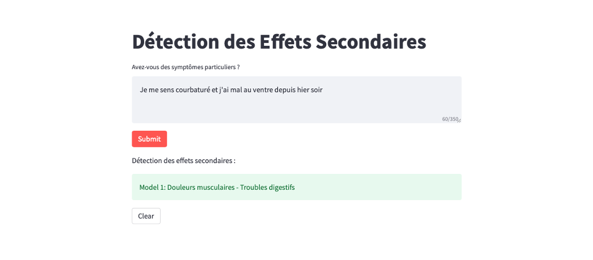

# Adverse Effect Detection

End-to-end deployment of a Streamlit application to detect adverse effects from free text using OpenAI GPT-3 model.



## Launch the App locally

1. Navigate into the project directory

   ```bash
   $ cd ae_detection
   ```

2. Create a new virtual environment

   ```bash
   $ python -m venv venv
   $ . venv/bin/activate
   ```

3. Install the requirements

   ```bash
   $ pip install -r api/requirements.txt streamlit/requirements.txt
   ```

4. Add your [OpenAI API key] to the `.env` file

5. Run the FastAPI service

   ```bash
   $ uvicorn main:app --reload
   ```

FastAPI service is running at [http://127.0.0.1:8000](http://127.0.0.1:8000)

6. Run the Streamlit App

   ```bash
   $ streamlit run app.py
   ```

Streamlit App is running at [http://127.0.0.1:8501](http://127.0.0.1:8501)

## Launch the App locally using Docker

1. Launch the services using docker-compose

   ```bash
   $ docker-compose build
   $ docker-compose up
   ```

## Launch the App remotely using Docker-compose

1. Create an EC2 instance (Amazon Linux AMI)
2. In the security group, allow inbound traffic on port 8000 and 8501.
3. Connect to the instance
4. Install docker and docker-compose (1.31.1)

   ```bash
   $ sudo yum update -y
   $ sudo amazon-linux-extras install docker
   $ sudo service docker start
   $ sudo systemctl enable docker
   $ sudo usermod -a -G docker ec2-user

   $ sudo curl -L https://github.com/docker/compose/releases/download/1.31.1/docker-compose-`uname -s`-`uname -m` | sudo tee /usr/local/bin/docker-compose > /dev/null
   $ sudo chmod +x /usr/local/bin/docker-compose
   $ ln -s /usr/local/bin/docker-compose /usr/bin/docker-compose
   ```

   4.2 Install docker and docker-compose using Ubuntu AMI

   ```bash
   $ sudo apt-get update
   $ sudo apt-get install docker.io
   $ sudo systemctl start docker
   $ sudo docker run hello-world
   $ sudo apt-get install docker-compose
   ```

5. (optional) Start a new tmux session

   ```bash
   $ sudo yum install tmux
   $ tmux new -s StreamlitSession
   ```

To detach from the TMUX session, use: Ctrl+B and then D

To reattach to the same session, use:

```bash
$ tmux attach -t StreamlitSession
```
